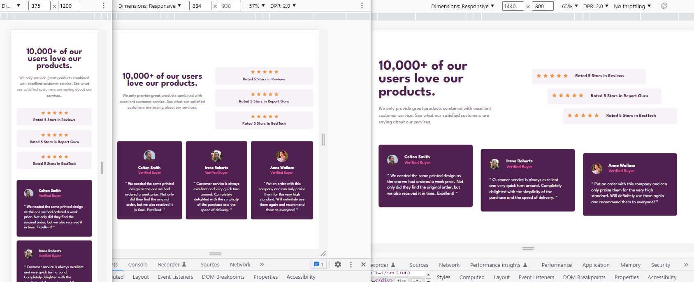

# Frontend Mentor - Social proof section solution

This is a solution to the [Social proof section challenge on Frontend Mentor](https://www.frontendmentor.io/challenges/social-proof-section-6e0qTv_bA).

## Table of contents

- [Overview](#overview)
  - [The challenge](#the-challenge)
  - [Screenshot](#screenshot)
  - [Links](#links)
- [My process](#my-process)
  - [Workflow](#workflow)
  - [Built with](#built-with)
  - [What I learned](#what-i-learned)
  - [Continued development](#continued-development)
  - [Useful resources](#useful-resources)
- [Author](#author)
- [Acknowledgments](#acknowledgments)

## Overview

### The challenge

Users should be able to:

- View the optimal layout for the section depending on their device's screen size

### Screenshot

### Links

- Solution: [frontendmentor.io](https://your-solution-url.com)

- Live Site: [github.io](https://siavhnz.github.io/frontendmentor/12.social-proof-section/index.html)

## My process

### Workflow
 - Setting up workflow (Initialize git, setting up folders structure)
 - Setting up CSS preflight (Adding css normalize, adding google fonts)
 - Creating HTML skeleton based on `./assets/design`
 - Working on mobile design (375 x 1530 px)
 - Working on desktop design (1440 x 800 px)
 - Writting README.md
 - Publish on github.io | github.com | frontendmentor.io

### Built with

- Semantic HTML5 markup
- CSS custom properties
- Mobile-first workflow
- Flexbox
- CSS Grid

### What I learned

I Learned when to use `margin-bottom: auto`. It's a better solution for alignment children of
an element instead of using `align-self` in this challenge on quotes section.

### Continued development

Reading and Practicing more on box alignment in CSS

### Useful resources

- [Quotation marks character](https://unicode-table.com/en/sets/quotation-marks/) 

## Author

- Frontend Mentor - [@siavhnz](https://www.frontendmentor.io/profile/siavhnz)

## Acknowledgments

Thanks To

[Frontendmentor.io](https://www.frontendmentor.io/challenges) - for their Excitement challenges  

[Perfect Pixel](https://chrome.google.com/webstore/detail/perfectpixel-by-welldonec/dkaagdgjmgdmbnecmcefdhjekcoceebi?hl=en) - for such a great extension

